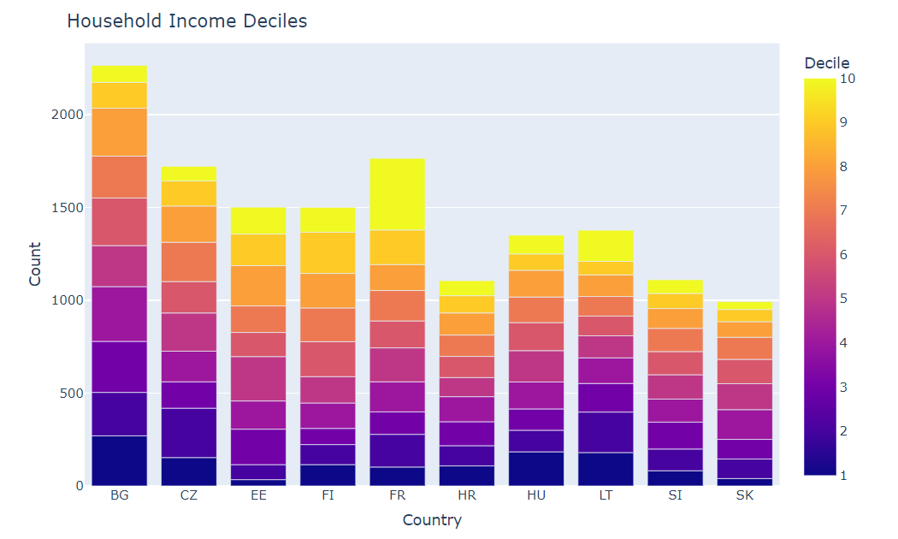

## Synopsis 
This project parses data from a data set (.csv) using python and generates interactive plots on a website using the python plotly library and netlify service. [Here](https://cerulean-daifuku-bf48e7.netlify.app/) is the live link of the project.

## Description
The European Social Survey (ESS) provides a variety of data for comparative analysis. Using the data collected in 2020 (ESS round 10) I aim to analyse and display core data of the European Social Survey in order to demonstrate my programming and statistical skills.

## Setup
Install all requirements from `requirements.txt` and run the python scripts in the `generate_plots` folder which generate plots which are referenced in `index.html`. Upon a commit a new version of the website is automatically deployed using netlify.

## Example Output
Executing `./generate_plots/household_income.py` the following plot is generated as interactive html (various output possibilities exist alongside html).

